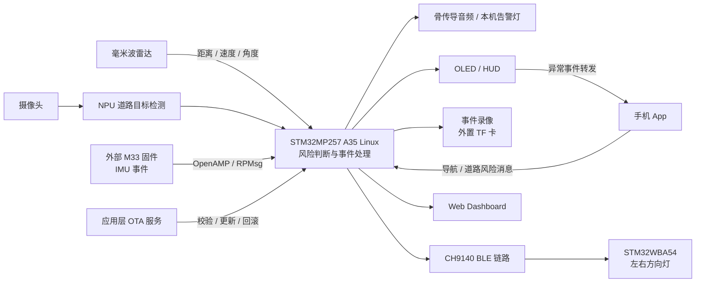

# STM32MP257 主动安全骑行辅助系统

面向骑行中侧后方来车、摔倒和导航提醒等场景的嵌入式项目。系统以 STM32MP257 为核心，结合毫米波雷达、摄像头与端侧 NPU，在开发板上完成风险判断，通过骨传导音频、HUD 和方向灯提醒骑行者，并保存风险事件前后的录像。

项目围绕“感知风险 → 判断事件 → 提醒骑行者 → 留存现场”组织功能，同时提供本地 Web Dashboard 和应用层 OTA，支持原型演示、运行状态观察和版本更新。

## 项目要解决的问题

骑行者需要持续关注前方路况，侧后方快速接近的车辆往往难以及时察觉；发生异常时，也需要保留事件前后的现场信息。这个项目将环境感知、即时提醒和事件录像放在同一套系统中，让风险信息从传感器到提示设备形成完整的处理链路。

## 核心功能

| 功能 | 项目中的实现 |
|---|---|
| **侧后方来车预警** | 毫米波雷达提供目标距离、速度、角度和碰撞时间信息；摄像头图像经 NPU 检测道路使用者，结合雷达风险与视觉连续确认触发告警。 |
| **方向提示** | 对危险目标方向进行滤波与连续确认，将左后方、正后方、右后方风险传到 STM32WBA54，控制左右方向灯。 |
| **事件录像** | 在 RAM 中持续预缓存 JPEG，风险触发后流式编码 MP4 并存入 TF，目标为前后各 15 秒；实际前段取决于启动时长与帧可用性。 |
| **摔倒告警** | A35 接收 M33 的 IMU 摔倒事件，联动本地灯光、音频和录像，并经 HUD 向手机转发事件。 |
| **导航与语音提醒** | 接收手机导航和道路风险消息，在 OLED/HUD 显示导航信息，并通过骨传导音频播报提示。 |
| **本地状态面板** | Web Dashboard 展示雷达目标、融合状态、传感器事件、录像进度和设备健康信息，支持实验标注与设备控制。 |
| **应用层 OTA** | 对 A35 运行程序与资源进行版本更新，提供包校验、健康检查和失败回滚。 |

## 系统架构

STM32MP257 的 A35 Linux 侧负责视觉推理、雷达融合、录像与人机交互；M33 侧的 IMU 事件通过 OpenAMP/RPMsg 进入 A35。蓝牙方向灯使用独立的 STM32WBA54 固件。



## 实现特点

- **雷达与视觉共同参与判断。** 雷达提供接近风险信息，NPU 提供道路目标确认，融合结果统一驱动告警、方向灯和录像。
- **推理在设备本地完成。** 摄像头检测使用 STM32MP257 的 NPU，核心碰撞风险判断在 A35 上运行。
- **按职责组织并发与资源。** Camera、NPU、Radar、DVR 独立处理，以有界队列传递结果；共享帧采用引用计数，设备与线程有明确生命周期。
- **围绕事件保存视频。** DVR 缓冲与风险触发联动；视频经过结构检查与完整解码校验后提交为正式文件。TF 卡异常时隔离录像故障，保留告警链运行。
- **可以观察完整的事件过程。** Dashboard 和同步记录串联雷达、视觉、IMU、提示与录像，便于对照现场事件分析系统行为。
- **具备原型运行与维护能力。** systemd 服务、存储管理、安全停止和 OTA 回滚共同支持设备持续运行与现场演示。

## V2V 协同预警实验

仓库还包含一套独立的双 STM32WBA54 V2V 实验固件。两个终端同时进行 BLE 广播与扫描，交换本机 GPS/IMU 状态，根据相对位置和接近趋势生成方向风险提示，并控制 MP3 模块播放语音。

该部分用于探索终端之间的协同预警，目前按固定双端点、单对端跟踪实现，仍需现场标定与场景验证。它与主系统的 CH9140 蓝牙方向灯使用不同的通信协议，分别维护。

## 仓库内容与实现范围

```text
mp257/
├── README.md                 # 项目介绍
├── docs/                     # 文档总览
├── apps/a35/                 # A35 Linux 核心程序、HUD、Dashboard、OTA 与资源
├── firmware/ble_direction/   # CH9140 链路对应的 WBA 蓝牙方向灯固件
└── firmware/v2v/             # 双 WBA V2V 语音预警实验固件
```

本仓库主要展示 A35 应用与两套 WBA 固件。手机 App、云端服务和 MP257 M33 固件在仓库之外维护；当前代码包含对应的消息接收或转发接口。手机短信发送仍缺少端到端回执确认，V2V 实验中的 MP257 外部状态发送端也尚未完成对接。

当前项目以骑行辅助原型和实验验证为定位。功能实现、验证记录及后续标定事项分别保存在对应工程文档中。

当前源码已接入多线程、RAII 与 RAM 缓存，并完成主机行为测试及 AArch64 源码对象编译检查。已跟踪的 1.0.8 包属于此前发布版本。

## 相关资料

- [文档总览](docs/README.md)：架构、验证记录、编译部署与日常维护资料。
- [当前应用设计](docs/VIDEO_PIPELINE_DESIGN.md)：线程职责、帧所有权、内存上限与事件窗口。
- [系统数据流](apps/a35/docs/DATA_FLOW.md)：感知、判断、告警与录像之间的数据流转。
- [事件链与演示说明](apps/a35/docs/COMPETITION_PREPARATION.md)：典型场景的处理过程及演示记录。
- [V2V 实验说明](firmware/v2v/README.md)：双终端状态交换、相对风险判断与语音事件机制。
