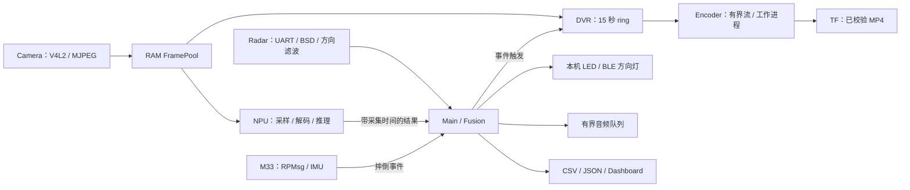

# 当前应用层链路

源码入口：[main.cpp](../src/app/main.cpp)。线程、帧池、队列容量和资源边界以[当前流水线设计](../../../docs/VIDEO_PIPELINE_DESIGN.md)为准。

## 感知与融合

Camera 独占摄像头，DQBUF 后复制 JPEG 到池槽，再 QBUF。NPU 从容量 2 的队列取得较新采样帧，解码后释放 JPEG 引用，独占模型和 RGB 工作区。Radar 独占串口与方向滤波状态，通过结果队列交给 Fusion。Fusion 不执行摄像头采集、JPEG 解码或 NPU 推理。

雷达风险仍根据距离、接近速度和 TTC 计算；危险目标的方向经过低通、滞回与连续样本稳定处理。视觉采用道路使用者类别连续 2 次确认、3 次否认。当前为道路用户存在性验证，尚未做同一视觉框与雷达 objId 的空间关联。

视觉结果 2 秒过期，摄像头 1 秒无新帧或视觉结果不可用时退化为雷达告警。雷达报告 3 秒无更新后清除该碰撞风险，并在 Dashboard 标记数据不可用。正常无目标报告与设备无报告分别处理。

## 事件输出与录像

风险上升沿投递碰撞提示，LED/BLE 跟随 Fusion 的最终风险。持续风险每秒延长 DVR 后段。录像有自己的窗口和资源状态，保存完成不重置风险或视觉确认。

DVR 持续维护 RAM ring，首次触发快照前段引用并开始传输，后段帧持续追加；通常前后各 15 秒，重复触发最长到首次触发后 60 秒。Encoder 通过管道传递 JPEG 给工作进程，正式视频提交前检查 MP4、ffprobe、整段解码及文件同步。实际前段帧数受启动时长、掉帧和容量限制。

GStreamer 后端使用 appsrc 和采集 PTS；硬件插件不齐时选择固定 25fps FFmpeg MPEG-4 兼容后端，日志标识实际后端。编码失败或队列溢出报告失败，告警链继续运行。

## M33、导航与外围接口

RPMsg 读取 IMU_ALERT / V2X_ALERT。摔倒提示保持 5 秒，事件时间通过原子邮箱交给 Fusion；IMU 文本转换为 JSON，经 localhost:8890 送 HUD，再由 HUD 转发手机。手机短信仍没有端到端 ACK，发送日志只表示本端投递结果。

`radar_fusion` 中的导航线程独占 UDP 8888 与 OLED，处理 navi、navi_tts、danger_tts、alert。独立 HUD 程序仅监听 `127.0.0.1:8890`，转发 IMU JSON 至手机 UDP 8889；序列化保留 GPS 等原始字段并正确转义文本。OLED 状态与看门狗共享锁；音频任务进入容量 8 的串行队列，告警优先，退出时回收任务并 join。danger_tts preload 只记录，trigger 提交最终文案；默认离线 TTS 策略保留。

BLE 输出沿用 UART → CH9140 → WBA54 协议，CLEAR / LEFT / CENTER / RIGHT 对应现有方向灯状态。串口写出和 drain 不等于远端执行 ACK。本次没有更改无线协议或固件收发语义。

## 源码阅读入口

| 链路 | 文件 |
|---|---|
| 配置与启动 | [app_config.cpp](../src/app/app_config.cpp)、[video_config.cpp](../src/runtime/video_config.cpp)、[main.cpp](../src/app/main.cpp)、[worker_group.hpp](../include/runtime/worker_group.hpp) |
| 采集与缓冲所有权 | [camera.c](../src/camera/camera.c)、[camera_worker.cpp](../src/runtime/camera_worker.cpp) |
| 帧池、ring 与队列 | [frame_pipeline.hpp](../include/runtime/frame_pipeline.hpp) |
| 推理 | [inference_worker.cpp](../src/runtime/inference_worker.cpp)、[npu_detect.cpp](../src/vision/npu_detect.cpp)、[ssd_postprocess.cpp](../src/vision/ssd_postprocess.cpp) |
| 雷达 | [radar_worker.cpp](../src/radar/radar_worker.cpp)、[radar_protocol.cpp](../src/radar/radar_protocol.cpp) |
| 视觉确认与时效 | [fusion_state.hpp](../include/runtime/fusion_state.hpp) |
| 录像状态与传输 | [dvr_worker.cpp](../src/runtime/dvr_worker.cpp)、[encoder_worker.cpp](../src/runtime/encoder_worker.cpp) |
| 编码与提交 | [dvr_encode_worker.py](../scripts/dvr_encode_worker.py)、[dvr_validation.py](../scripts/dvr_validation.py) |
| RPMsg、遥测、导航 | src/events、src/telemetry、src/navigation |

线程是 Linux 调度单位，由调度器分配 CPU 执行时间。
