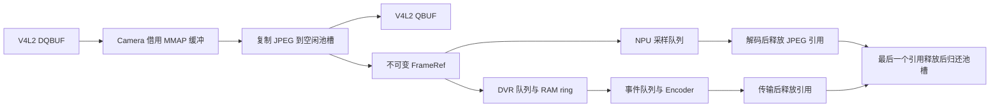

# A35 多线程与 RAM 视频流水线

本文对应 `apps/a35` 当前源码。生产入口为 `src/app/main.cpp`，`VideoPipeline::start()` 实际启动 Camera、NPU、DVR 和 Encoder 线程，Radar 独立接收。构建仅包含这套入口。

## 职责与所有权

| 执行单元 | 工作与资源所有权 | 交接 |
|---|---|---|
| Main / Fusion | 视觉连续确认、雷达时效、最终风险、BLE 状态、录像触发 | 读取 Radar/NPU 结果；投递 DVR 触发 |
| Camera | V4L2 fd、MMAP、采集、重连、帧池生产 | 复制 JPEG 后 QBUF；分发不可变 FrameRef |
| NPU | NpuDetector、STAI 网络、RGB 与输入张量 | 每 10 个保留帧取一个；发布带采集时间戳的结果 |
| DVR | 最近 15 秒 RAM ring、事件窗口、当前编码会话 | 快照前段，追加后段，关闭会话队列 |
| Encoder | stdin 管道、工作进程与进程组 | 顺序传输 JPEG，释放引用，等待编码结果 |
| RPMsg | M33 IMU/V2X 输入 | 摔倒通过原子邮箱交给 Fusion；转发 HUD |
| 导航 / 音频 / LED | UDP、OLED、有界串行播放、灯光执行 | 独立运行，退出时 join |

这是逻辑职责划分。STM32MP257 为双 Cortex-A35，线程由 Linux 调度；代码没有将四个业务线程绑定到四个 CPU。

## 帧生命周期

`camera_capture()` 出队后借出地址，`camera_release()` 才入队。`CameraLease` 保证提前返回或异常时归还缓冲。跨线程传递已复制的 RAM 数据，没有消费者读取 QBUF 后的 MMAP 指针。

FramePool 预分配槽，`shared_ptr<const Frame>` 表达共享只读所有权。ring 淘汰时，Encoder/NPU 持有的帧仍有效；最后一个引用释放才归还 free list。池的共享状态也随尚存引用保留。实现采用互斥锁与标准引用计数。

预分配的是 Frame 及 JPEG 数据区；`shared_ptr` 控制块和容器节点仍可能分配小块内存。当前实现不承诺运行期间完全无堆分配。

## 容量与满队列

默认 896 个 256 KiB JPEG 槽，**池占 224 MiB**。RGB 工作区约 25.3 MiB，STAI、V4L2、编码器与系统内存另算。`--pool-mib`、`--max-jpeg-kib` 联合校验，至少 878 槽。JPEG 超过单槽上限或池满时丢帧并计数。

| 结构 | 上限 | 满时处理 |
|---|---:|---|
| DVR 输入 | 32 帧 | 淘汰最旧帧、计数 |
| NPU 输入 | 2 帧 | 淘汰最旧帧、计数 |
| Radar/NPU 结果 | 各 8 条 | 淘汰最旧结果 |
| RAM ring | 375 帧且不超过 15 秒 | 按时间与容量淘汰 |
| DVR 触发 | 16 条 | 拒绝并报告 |
| 当前事件输入 | 375 + 64 帧 | 中止录像并报告溢出 |
| 编码会话 | 同时 1 个 | 忙时拒绝另一个事件，继续维护 ring |
| 音频任务 | 8 条 | 普通任务拒绝；告警优先并替换尾部任务 |

Camera 保留最多 25 fps，NPU 约每 0.4 秒获得候选帧。队列支持关闭与唤醒。启动不足 15 秒、掉帧、JPEG 超限或积压时，实际前段较短；日志记录 pre_frames 和丢帧计数。

## 录像事件与编码

摄像头可用时持续维护 ring。首次触发快照前段引用，后续帧追加到事件队列；重复触发延长后段，最多到首次触发后 60 秒。通常为前 15 秒、后 15 秒；长事件仍受内存限制。

Encoder 将 `uint64 timestamp_us + uint32 jpeg_size + JPEG` 小端记录传给 Python 工作进程，正常结束才发送 12 字节全零记录。EOF、溢出或半帧均不算成功。JPEG 不落地到 TF 或临时文件。

工作进程选择可用后端，明确记录选择结果：

- Python GI/GStreamer 和编码插件齐全时：`appsrc → jpegdec → videoconvert → NV12 → v4l2slh264enc → h264parse → mp4mux`。输入 PTS 来自采集时间，appsrc 有字节上限与背压。
- 插件不可用时：FFmpeg `image2pipe → MPEG-4 → MP4`，固定 25 fps，采集间隙不保留原始 PTS。硬件后端中途失败终止事件，不重放已消耗的 RAM 流。

TF 保存编码后的 `.mp4.part`、验证日志与正式 MP4。提交需通过挂载检查、MP4 box、ffprobe、整段解码、fsync，再 rename 和目录 fsync；正式视频按 12 个 / 2 GiB 轮转。Encoder 管理管道超时、工作进程超时和进程组回收。

## 融合与退出

Fusion 连续 2 次视觉确认、连续 3 次否认清除确认。结果以采集时间判断，2 秒过期；摄像头或视觉结果不可用时使用雷达告警。Radar 3 秒无报告后解除风险。风险上升沿播放语音，持续风险每秒延长录像。编码结果不修改风险、视觉或 IMU 状态。摔倒提示保持 5 秒，录像窗口独立管理。

退出关闭队列并 join，未完成录像中止，RAM 内容丢失。STAI run 若在驱动内部永久阻塞，标准 join 无法强制终止，仍依赖 BSP 与 systemd 的进程级超时。

主机检查覆盖帧回收、并发队列、ring、事件期限、视觉时效和编码流边界；AArch64 Linux 源码对象通过交叉编译检查。历史 1.0.8 包不代表本次源码。

实现依据：[V4L2 缓冲所有权](https://docs.kernel.org/userspace-api/media/v4l/vidioc-qbuf.html)、[GStreamer appsrc](https://gstreamer.freedesktop.org/documentation/app/appsrc.html)。
